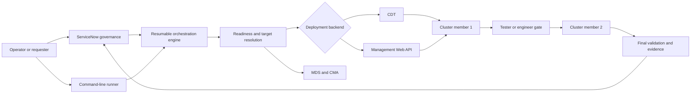

<div align="center">

# Check Point + ServiceNow Firewall Automation

**A production-oriented reference implementation for governed Check Point
software maintenance with Ansible.**

[](https://github.com/SGT-Trojan/checkpoint-servicenow-automation/actions/workflows/validate.yml)
[](LICENSE)
[](requirements.txt)
[](requirements.txt)
[](SECURITY.md)

Command-line execution and optional ServiceNow governance share the same
readiness checks, rolling controls, evidence model, and resumable execution
engine.

[Architecture](docs/ARCHITECTURE_AND_ENGINEERING_GUIDE.md) | [ServiceNow build guide](docs/SERVICENOW_BUILD_GUIDE.md) | [Workflow walkthrough](docs/WORKFLOW_WALKTHROUGH.md) | [Security](SECURITY.md)

</div>

> [!CAUTION]
> This software can install and remove packages, fail over clusters, update
> policy state, and perform major upgrades. Begin with offline tests and
> read-only discovery in a non-production environment. Do not bypass readiness,
> tester, remediation, policy, or rollback gates.

## What This Repository Provides

| Area | Included behavior |
|---|---|
| Target resolution | MDS/CMA, cluster, member, and policy discovery with complete pagination and fail-closed ambiguity handling |
| Readiness | SIC, ClusterXL, interfaces, PNOTEs, ICAP, CPUSE, Deployment Agent, checksums, prerequisites, and disk/rollback capacity |
| Software patches | Rolling JHF and wrapper installation or removal with controlled failover and per-member validation |
| Major upgrades | Mixed-version controls, MVC handling, policy gates, tester approval, and original-active restoration |
| Deployment Agent | Currency discovery, package validation, and dedicated dual-member installation path |
| Governance | ServiceNow REQ/RITM/SCTASK/CHG/CTASK lifecycle with readiness, tester, remediation, and final-validation tasks |
| Recovery | Durable phase state, delayed tester gates, engineer remediation, and resume from the failed phase |
| Package tooling | Current and archived Recommended JHF discovery, interactive selection, resumable download, and SHA1/SHA256 verification |

## Execution Architecture



The deployment backend is an implementation choice. Governance, readiness,
cluster safety, tester gates, remediation, and evidence remain outside the
backend so they cannot be skipped by changing transport.

## Choose an Operating Mode

| Goal | Start here |
|---|---|
| Run directly from a controlled automation host | [Architecture and engineering guide](docs/ARCHITECTURE_AND_ENGINEERING_GUIDE.md) |
| Reproduce the full ServiceNow-governed implementation | [ServiceNow build guide](docs/SERVICENOW_BUILD_GUIDE.md) |
| Understand the request-to-completion lifecycle | [Workflow walkthrough](docs/WORKFLOW_WALKTHROUGH.md) |
| Inventory installed patches across managed gateways | [Patch inventory guide](tools/CHECKPOINT_PATCH_INVENTORY.md) |
| Discover or securely download a JHF | [JHF currency and download guide](tools/JHF_CURRENCY_AND_DOWNLOAD.md) |
| Assess Deployment Agent currency | [Deployment Agent currency guide](tools/DEPLOYMENT_AGENT_CURRENCY.md) |

ServiceNow is optional. The command-line runner uses the same Ansible-driven
maintenance phases without requiring a ServiceNow instance.

## Quick Start

```bash
git clone https://github.com/SGT-Trojan/checkpoint-servicenow-automation.git
cd checkpoint-servicenow-automation
python3 -m venv .venv
. .venv/bin/activate
python3 -m pip install --upgrade pip
python3 -m pip install -r requirements.txt
```

Copy and edit the example inventory. Keep credentials outside Git and inject
them through protected environment or vault-backed configuration.

```bash
cp ansible/inventory/hosts.yml ansible/inventory/hosts.local.yml
python3 checkpoint_cluster_upgrade.py --help
python3 servicenow_checkpoint_runner.py --help
```

Start with read-only discovery and readiness. Do not begin with an install,
removal, failover, or upgrade against an unvalidated environment.

### JHF discovery example

```bash
python3 tools/cpuse_jhf_fetch.py --version R82 --list
python3 tools/cpuse_jhf_fetch.py --version R82 --menu --dest /srv/checkpoint/packages
```

The menu distinguishes current Recommended, current Latest, and archived
Recommended Takes. A selected package is checked against official metadata and
both published hashes before it is accepted.

## Repository Map

```text
ansible/
  inventory/                 Example controller inventory
  playbooks/                 Readiness, execution, failover, and postcheck phases
  scripts/                   Target resolution and backend helper programs
  scripts/tests/             Offline orchestration and adversarial tests
docs/                        Architecture, workflow, and ServiceNow build guides
systemd/                     Long-running worker service definitions
test_inputs/                 Sanitized activity-plan examples
tools/                       JHF, Deployment Agent, inventory, and hygiene utilities
checkpoint_cluster_upgrade.py
servicenow_checkpoint_runner.py
servicenow_checkpoint_worker.py
```

## Safety Model

The workflow is designed to fail closed when it cannot establish authoritative
identity, topology, package metadata, policy context, cluster health, or resume
state. Mutating execution is separated from discovery and requires explicit
execution intent.

- Resolve every requested address to one logical managed object.
- Validate exact package identity and checksums before staging or execution.
- Preserve rolling member order and require controlled failover.
- Stop at tester and engineer-remediation gates instead of guessing.
- Persist phase state so a delayed approval does not repeat completed members.
- Revalidate governance and target state before resuming.
- Retain sanitized summaries while excluding credentials and session material.

See [SECURITY.md](SECURITY.md) for reporting and operational-security rules.

## Validate a Checkout

```bash
python3 -m unittest discover -s ansible/scripts/tests -v
python3 -m unittest discover -s tools/tests -v
for playbook in ansible/playbooks/*.yml; do
  ansible-playbook --syntax-check "$playbook" -i ansible/inventory/hosts.yml
done
python3 tools/scan_public_repository.py .
```

GitHub Actions runs the protected `test` and `secrets` checks for every pull
request. Public exports are generated from an allowlisted source tree and carry
a SHA-256 manifest.

## Project Scope

This repository is a reference implementation, not a Check Point or ServiceNow
support commitment. Validate exact product releases, package critical
information, Deployment Agent requirements, API/CDT behavior, and ServiceNow
family behavior in your own environment.

No Check Point packages, licenses, credentials, snapshots, ServiceNow exports,
or live-system evidence are distributed here. Product names and trademarks
belong to their respective owners.

## License

Original source code is licensed under the [Apache License 2.0](LICENSE). See
[NOTICE](NOTICE) for trademark and independence statements.
