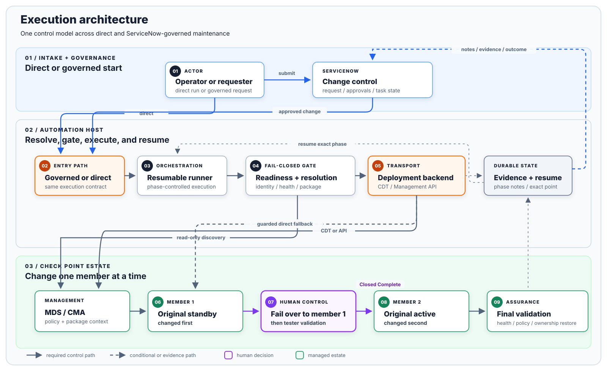

<div align="center">

# Check Point + ServiceNow Firewall Automation

**A reference implementation for governed Check Point firewall maintenance with Ansible.**

[](https://github.com/SGT-Trojan/checkpoint-servicenow-automation/actions/workflows/validate.yml)

[<kbd>Apache-2.0</kbd>](LICENSE) [<kbd>Python 3.10+</kbd>](requirements.txt) [<kbd>Ansible Core 2.16-2.21</kbd>](requirements.txt)

Run it directly from an automation host or place ServiceNow in front of it.
Both paths use the same prechecks, member order, pause points, and run state.

[Architecture](docs/ARCHITECTURE_AND_ENGINEERING_GUIDE.md) | [CDT and Management API](docs/CDT_AND_MANAGEMENT_API.md) | [Component reference](docs/COMPONENT_REFERENCE.md) | [Certified scenarios](docs/CERTIFIED_SCENARIOS.md) | [ServiceNow build guide](docs/SERVICENOW_BUILD_GUIDE.md) | [Workflow walkthrough](docs/WORKFLOW_WALKTHROUGH.md) | [Security](SECURITY.md)

</div>

## Contents

- [What This Repository Provides](#what-this-repository-provides)
- [Live Validation Snapshot](#live-validation-snapshot)
- [Quick Start](#quick-start)
- [Documentation](#documentation)
- [Execution Architecture](#execution-architecture)
- [Repository Map](#repository-map)
- [Validate a Checkout](#validate-a-checkout)
- [Scope](#scope)
- [License](#license)

> [!CAUTION]
> This software can change packages, policy state, and cluster ownership. Start
> with offline tests and read-only discovery in a non-production environment.
> Resolve every target to one managed object, verify package hashes, change one
> member at a time, and stop for tester or remediation tasks when prompted.

## What This Repository Provides

| Area | Included behavior |
|---|---|
| Target resolution | MDS/CMA, cluster, member, and policy discovery with complete pagination and fail-closed ambiguity handling |
| Readiness | SIC, ClusterXL, interfaces, PNOTEs, ICAP, CPUSE, Deployment Agent, checksums, prerequisites, and disk/rollback capacity |
| Software patches | Rolling JHF and wrapper installation or removal with controlled failover and per-member validation |
| Major upgrades | Mixed-version controls, MVC handling, policy gates, tester approval, and original-active restoration |
| Deployment Agent | Currency discovery, package validation, and dedicated dual-member installation path |
| Governance | ServiceNow REQ/RITM/SCTASK/CHG/CTASK lifecycle with readiness, tester, remediation, and final-validation tasks |
| Recovery | Durable phase state, delayed tester gates, engineer remediation, and resume from the failed phase |
| Package tooling | Current and archived Recommended JHF discovery, interactive selection, resumable download, and SHA1/SHA256 verification |

## Live Validation Snapshot

| Control path | Live-validated scenarios |
|---|---|
| ServiceNow + CDT | R81.20 Take 76 install and uninstall; R81.20 build 634/Take 0 to R82 build 777/Take 60 major upgrade; real approvals, tester gates, remediation resume, and closure |
| Command line + CDT | The same R81.20 Take 76 and R81.20-to-R82 sequence with runner-level gates; R82 Take 60 to Recommended Take 107 rolling install |
| Command line + Management API | R81.20 Take 76 install and R81.20-to-R82 major upgrade; Take 76 removal through the documented guarded direct CPUSE fallback because the tested API rejected safe per-member uninstall semantics |
| Deployment Agent | ServiceNow-driven idempotent workflow validation for build 2771 on both members using the dedicated dual-member path |

These are evidence points from a two-member lab cluster, not a vendor support
matrix or a claim that adjacent releases are automatically compatible. The
major-upgrade source was R81.20 Take 0 after Take 76 removal; a direct R81.20
Take 76 to R82 transition has not been separately certified. See the
[complete certification matrix](docs/CERTIFIED_SCENARIOS.md) for dates, gates,
review status, limitations, and untested combinations.

## Quick Start

```bash
git clone https://github.com/SGT-Trojan/checkpoint-servicenow-automation.git
cd checkpoint-servicenow-automation
python3 -m venv .venv
. .venv/bin/activate
python3 -m pip install --upgrade pip
python3 -m pip install -r requirements.txt
```

Copy and edit the example inventory. Keep credentials outside Git and inject
them through protected environment or vault-backed configuration.

```bash
cp ansible/inventory/hosts.yml ansible/inventory/hosts.local.yml
python3 checkpoint_cluster_upgrade.py --help
python3 servicenow_checkpoint_runner.py --help
```

Start with read-only discovery and readiness. Do not begin with an install,
removal, failover, or upgrade against an unvalidated environment.

### JHF discovery example

```bash
python3 tools/cpuse_jhf_fetch.py --version R82 --list
python3 tools/cpuse_jhf_fetch.py --version R82 --menu --dest /srv/checkpoint/packages
```

The menu distinguishes current Recommended, current Latest, and archived
Recommended Takes. A selected package is checked against official metadata and
both published hashes before it is accepted.

## Documentation

| Goal | Start here |
|---|---|
| Run directly from a controlled automation host | [Architecture and engineering guide](docs/ARCHITECTURE_AND_ENGINEERING_GUIDE.md) |
| Choose between CDT and Management API deployment | [CDT and Management API deployment](docs/CDT_AND_MANAGEMENT_API.md) |
| Reuse individual scripts or playbooks | [Component and integration reference](docs/COMPONENT_REFERENCE.md) |
| Reproduce the full ServiceNow-governed implementation | [ServiceNow build guide](docs/SERVICENOW_BUILD_GUIDE.md) |
| Understand the request-to-completion lifecycle | [Workflow walkthrough](docs/WORKFLOW_WALKTHROUGH.md) |
| Review exactly which versions and paths were exercised live | [Certified scenarios](docs/CERTIFIED_SCENARIOS.md) |
| Inventory installed patches across managed gateways | [Patch inventory guide](tools/CHECKPOINT_PATCH_INVENTORY.md) |
| Discover or securely download a JHF | [JHF currency and download guide](tools/JHF_CURRENCY_AND_DOWNLOAD.md) |
| Assess Deployment Agent currency | [Deployment Agent currency guide](tools/DEPLOYMENT_AGENT_CURRENCY.md) |

ServiceNow is optional. The command-line runner uses the same Ansible-driven
maintenance phases without requiring a ServiceNow instance.

## Execution Architecture

<a href="docs/diagrams/execution-architecture.svg">
  
</a>

<p align="center"><sub><a href="docs/diagrams/execution-architecture.svg">Open the architecture diagram at full size</a></sub></p>

The backend is transport. Target checks, member order, failover control,
human gates, and evidence collection run outside it, so switching backends
cannot skip them.

## Repository Map

```text
ansible/
  inventory/                 Example controller inventory
  playbooks/                 Readiness, execution, failover, and postcheck phases
  scripts/                   Target resolution and backend helper programs
  scripts/tests/             Offline orchestration and adversarial tests
docs/                        Architecture, workflow, and ServiceNow build guides
systemd/                     Long-running worker service definitions
test_inputs/                 Sanitized activity-plan examples
examples/                    Standalone helper and playbook examples
tools/                       JHF, Deployment Agent, inventory, and hygiene utilities
checkpoint_cluster_upgrade.py
servicenow_checkpoint_runner.py
servicenow_checkpoint_worker.py
```

## Validate a Checkout

```bash
python3 -m unittest discover -s ansible/scripts/tests -v
python3 -m unittest discover -s tools/tests -v
for playbook in ansible/playbooks/*.yml examples/playbooks/*.yml; do
  ansible-playbook --syntax-check "$playbook" -i ansible/inventory/hosts.yml
done
python3 tools/scan_public_repository.py .
```

GitHub Actions runs the protected `test` and `secrets` checks for every pull
request. Public exports are generated from an allowlisted source tree and carry
a SHA-256 manifest.

## Scope

Validated combinations are listed in the [certification matrix](docs/CERTIFIED_SCENARIOS.md); see [SECURITY.md](SECURITY.md) before connecting the code to an environment. Vendor packages, credentials, snapshots, and live evidence are not distributed here.

## License

Original source code is licensed under the [Apache License 2.0](LICENSE). See
[NOTICE](NOTICE) for trademark and independence statements.
